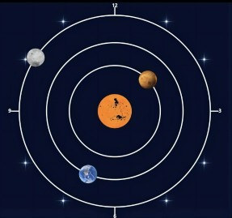

## MDDN 242 Project 1: Time-based Media  

# MDDN242 Project 1 ———— Solar System

**Student Name**: Pengyuan Zhang

## Design Intent

My project is a solar system-themed dynamic clock. With this design, I intend to provide an innovative way of displaying time while bringing visual enjoyment and mental pleasure to the user. By simulating the movement of the sun and the planets to display time, I wanted to make this clock not just a tool for checking time but a visual art piece that would catch the eye and inspire thought. I chose to symbolize the different units of time with the changing positions of the planets in their orbits, hoping to create an aesthetically pleasing and creative expression of time. In addition, I added the twinkling starry sky background as well as artificial satellites, aliens, and other elements. Not only to increase the mystery and depth of the night sky but also to make the whole clock design more vivid and full of motion. I hope that this design can trigger the audience to think about the nature of time, the desire to explore the world of outer space, and at the same time bring an injection of art and imagination into our living space.

## Development Phases

### 1. Initial Idea Sketch

I planned to create a solar system-themed clock that uses the planets in our solar system as symbols for the different units of time. Centered around the sun, the planets that revolve around the sun represent the different parts of time. I decided to use Jupiter, the Earth, and the Moon to represent the hour, minute, and second hands, respectively. They orbit in their respective orbits just as the hands of a clock rotate. While working on that sketch, I was inspired by the fact that the moment when the hour, minute, and second hands are perfectly aligned in a straight line symbolizes the occurrence of a solar eclipse. That is, the alarm clock will manifest itself as an eclipse.

### 2. Second Draft Sketch

In the second draft drawing, I got the idea to add some stars that might represent different moments around the orbit.

### 3. Media Clock

This is the prototype of my first media clock which I have drawn in the `media clock.js` file. I drew the orbits of the planets and represented the different planets with circles of different colors and sizes.

### 4. Media Clock Improvement

Next, I improved my media clock by adding a twinkling star background as well as deepening the background color. I think the darker blue color better reflects the vastness of the universe. The twinkling star background also adds more interest to the image.

### 5. Clock Upgrade

The next step was to upgrade the clock. I chose some pictures to replace the monotonous circle and added the alarm clock feature. I dropped the first idea of an eclipse because it was hard to implement. The new effect is that when the alarm starts, the stars around it will start twinkling.

### 6. Final Clock

I decided to turn the style in a cartoonish direction and show my clock in a cute sticker style. The picture became more harmonious. I gave up the idea of using stars and numbers to express the moments; it was too cliché. I started to try to distribute the stars in all corners and added more interesting elements, for example, rockets, satellites, UFOs, and so on. The initial twinkling star background also came back to add some movement to my clock.

## Final Alarm Clock Design

When the alarm is triggered, I chose to have the stars, meteors, and UFOs in the background twinkling at the same time. I wanted to create a unique and imaginative moment that would take the viewer briefly out of everyday life and into a cosmic space full of fantasy and discovery, which adds to the charm of the visual effects of my clock.

